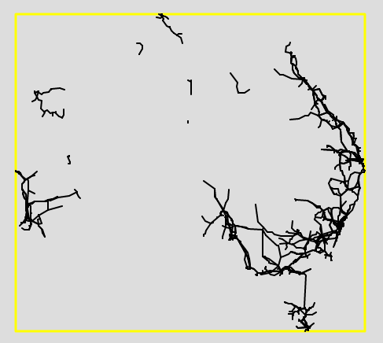

Visualise and gain insights into Australian infrastructure.#

## Ideas

- [x] extract data from geodatabase
- [x] display vector data from geodatabase
- [ ] colour based on line voltage
- [ ] add in substation data
- [ ] add in energy-source data

## Electricity

https://www.nature.com/articles/sdata2018203#data-records

### Substations

https://ecat.ga.gov.au/geonetwork/srv/eng/catalog.search#/metadata/83173

### Transmission Lines

 http://pid.geoscience.gov.au/dataset/ga/83105  

# Process

## visualise electricity vectors

### My guess:

geodatabase --> extract vector layer --> convert to mercator projection if necessary--> send to map

### Real method

geodatabase --> extract feature class --> iterate over features in feature class --> extract data from feature --> reverse lon,lat tuples --> send to map

## basic statistics about network

# Log

tried to install gdal/osgeo using pip. required visual c++ v14+. could not get it to work.

So i tried conda to install it without installing the dependencies myself. this was successful. However due to conflicts with conda and pip many of my python libraries were busted and i couldnt open jupyter notebooks.

Reinstalled miniconda, wiping away all packages. This time i used pip normally for other things, but made a separate conda environment for spatial related libraries like geopandas and gdal/osgeo. Then i enter the environment with:

`conda activate spatial-venv`

Working out how to visualise vector data using python.  

First i need to check how to turn the name of a layer within a geodatabase into a visual.

After trying the above, i realise i need to revise what gdal/osgeo actually does.

> GDAL is a C++ translator library for more than 200 [raster](http://gdal.org/formats_list.html) and [vector](http://gdal.org/ogr_formats.html) geospatial data formats[driver documentation page](https://gdal.org/)
>
>  **Geospatial Data Abstraction Library,  Open Source Geospatial Foundation** 

- geodatabases require the [OpenFileGDB](https://gdal.org/drivers/vector/filegdb.html) driver to access the contents.
  - must be a directory, and must end with .gdb extension
  - provides read and write access to vector layers of File Geodatabases (.gdb directories) 
- more information on the gdal API specs for C++ are [here](https://gdal.org/tutorials/vector_api_tut.html) and [here](https://gdal.org/user/vector_data_model.html#vector-data-model)

This tells me that i need to understand what a vector-based visualisation requires, and what tools are available to use. (I could have realised this earlier)

After searching for [`python gdal visualise vector example`]():

- [examples for manipulating raster layers](https://geoscripting-wur.github.io/PythonWeek/VectorPython.html)

I was looking to see something other than folium, but it seems that it can be used for this. So I'll use it in this project as well.

- learned about the [Difference between a geodatabase and a shapefile](https://blogs.library.duke.edu/data/2015/09/14/shapefiles-vs-geodatabases/) (USEFUL)

The data i have is a **File GeoDatabase**. GeoDatabase s can be organised with Feature Datasets. These store Feature Classes (the equivalent to ShapeFiles).  So what i need is to extract the feature class i want: ***ElectricityTransmissionLines_v2***.

So, since there is only one feature class, it can be found using GetLayerByIndex(0). Or GetLayerByName(***ElectricityTransmissionLines_v2***).

I got it working! 

# Misc info

## [Difference between a geodatabase and a shapefile](https://blogs.library.duke.edu/data/2015/09/14/shapefiles-vs-geodatabases/)

### Shapefile 

Requires:

- .shp – this file stores the geometry of the feature
- .shx – this file stores the index of the geometry
- .dbf – this file stores the attribute information for the feature

>  All files for the shapefile must be stored in the same location with the same name or else the shapefile will not load 

### GeoDatabase

>  There are[ two types of single user geodatabases](http://resources.arcgis.com/en/help/main/10.2/index.html#/Types_of_geodatabases/003n00000007000000/): File Geodatabase and Personal Geodatabase 

### File GeoDatabase

- 1TB storage limit

- better performance
- one user editing the GeoDatabase does exclusively lock read and write permissions for others.
- compressable

### Personal GeoDatabase

> designed in conjunction with Microsoft Access (oh no), with the extension:  .mdb 

- 2GB storage

GeoDatabases can be organised with Feature Datasets. These store Feature Classes (the equivalent to shapefiles).  

OGR supports many different vector formats:

- ESRI formats such as shapefiles, personal geodatabases and ArcSDE
- Other software such as MapInfo, GRASS, Microstation
- Open formats such TIGER/Line, SDTS, GML, KML
- Databases such as MySQL, PostgreSQL, Oracle Spatial, etc.
- Webservices such as Web Feature Service 1.0,1.1,2.0 (WFS output as GML)

 OSR =  spatial reference (projections!) 

## LAT,LON or LON,LAT

- [src](https://stackoverflow.com/questions/18636564/lat-long-or-long-lat)

> LAT, LON due to  [ISO 6709](https://en.wikipedia.org/wiki/ISO_6709). 

- Latitude comes before longitude
- North latitude is positive
- East longitude is positive
- Fraction of degrees is preferred over sexagesimal (degrees, minutes, seconds) notation

However LON = x, LAT = y on a plane, so some mathematical functions will use LON,LAT as the ordering.

## WKT

[WKT INFORMATION](https://en.wikipedia.org/wiki/Well-known_text_representation_of_geometry#Geometric_objects) seems to be a good reference as to how spatial vector data is perceived.

Interesting tidbit:

> *EWKT* and *EWKB* – *Extended Well-Known Text/Binary* 
>
> A [PostGIS](https://en.wikipedia.org/wiki/PostGIS)-specific format that includes the [spatial reference system identifier](https://en.wikipedia.org/wiki/Spatial_reference_system_identifier) (SRID) and up to 4 ordinate values (XYZM).[[4\]](https://en.wikipedia.org/wiki/Well-known_text_representation_of_geometry#cite_note-4)[[5\]](https://en.wikipedia.org/wiki/Well-known_text_representation_of_geometry#cite_note-5) For example: `SRID=4326;POINT(-44.3 60.1)` 

## Coordinates Numbers

 SRIDs are used to uniquely identify the coordinate systems used to  define columns of spatial data or individual spatial objects in a  spatial column.

Looking again at [ISO 6709](https://en.wikipedia.org/wiki/ISO_6709) for some info:

**XYZM**:

- **X/Y/Z** is the cartesian plane
  - X: Longitude, Y: Latitude, Z:  Vertical coordinate, i.e. height or depth 
- **M** is any kind of variable for a given location, like temperature, time,... which isn't directly interpreted as a location 

# Questions Generated through exploration

- just how prevalent are such open source tools as opposed to ESRI?
- why is there not an easy way to find information through google?
- what would be the optimal way to teach someone about using GIS like this?
  - should i have just read a tutorial on QGIS for this?
    - probably no. i learned a lot about the data-types involved and how to search for spatial information on the internet.